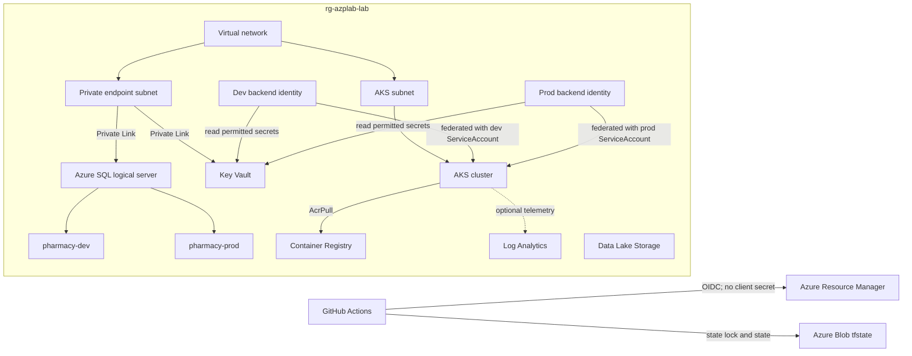

# Infrastructure Resource Catalog

## Purpose

This document explains every Terraform-managed component in the lab, why it
exists, what it depends on and which platform component consumes it. The
configuration uses production patterns, but the resulting platform is a
cost-controlled laboratory rather than a highly available production system.

## End-to-end architecture



The application uses the normal service hostnames
`<server>.database.windows.net` and `<vault>.vault.azure.net`. Azure private DNS
resolves those names to private endpoint addresses inside the virtual network.

## Terraform execution and state

### Remote backend

File: `environments/lab/backend.tf`

The `azurerm` backend stores `lab.tfstate` in the pre-created `tfstate`
container of `tfmoinstorage` in the `state-file-storage` resource group. Remote
state is required so multiple engineers and CI jobs use the same source of truth
and Azure Blob leases provide state locking. `use_azuread_auth = true` avoids a
storage-account access key in the repository.

The state storage resources are bootstrap dependencies and are intentionally not
managed by the same state file they store. Deleting them would make Terraform
lose access to its state.

### Provider and version constraints

Files: `environments/lab/providers.tf` and `environments/lab/versions.tf`

- Terraform is constrained to `>= 1.13.0, < 2.0.0`.
- AzureRM is constrained to `~> 4.0`, allowing compatible 4.x updates.
- The provider targets the explicitly supplied subscription.
- Soft-deleted Key Vaults can be recovered, while a deliberate lab destroy also
  purges the vault so its globally unique name can be reused.
- Resource-group deletion is allowed even when child resources are present,
  which supports complete laboratory cleanup.

### Azure data sources

| Terraform address | Purpose |
|---|---|
| `data.azurerm_client_config.current` | Reads the authenticated tenant ID used by AKS, Key Vault and Azure SQL. It does not create a resource. |
| `data.azurerm_subscription.current` | Reads the subscription resource ID used as the scope of the monthly budget. |

## Root environment resources

File: `environments/lab/main.tf`

### Resource group

`azurerm_resource_group.platform` creates `rg-azplab-lab`. It is the lifecycle,
location, tagging and access-control boundary for the laboratory resources. The
separate state resource group is not part of this lifecycle.

### AKS control-plane identity

`azurerm_user_assigned_identity.aks_control_plane` is the stable identity used
by the AKS managed control plane when it needs to manage Azure resources. A
user-assigned identity exists independently of the cluster and avoids relying on
a credential stored in code.

`azurerm_role_assignment.aks_subnet_network_contributor` gives that identity
`Network Contributor` only on the AKS subnet. AKS needs this permission to manage
network interfaces and addresses for cluster networking. The scope is the subnet,
not the subscription or entire resource group.

### Backend workload identities

`azurerm_user_assigned_identity.backend` creates two identities:

- `id-azplab-backend-dev`
- `id-azplab-backend-prod`

Separate identities prevent the dev workload from inheriting the prod workload's
identity. Identity is separated even though both environments share one lab AKS
cluster.

`azurerm_federated_identity_credential.backend` trusts tokens issued by the AKS
OIDC issuer for exactly these Kubernetes subjects:

- `system:serviceaccount:dev:pharmacy-backend`
- `system:serviceaccount:prod:pharmacy-backend`

The subject match is exact. A pod using a different namespace or ServiceAccount
cannot exchange its Kubernetes token for the managed identity token.

`azurerm_role_assignment.backend_key_vault_secrets_user` grants each backend
identity the `Key Vault Secrets User` data-plane role on the lab vault. It permits
reading secret values but not creating, deleting or administering secrets.

The older vault-wide permission for the AKS Secrets Store add-on identity is
removed. The CSI driver runs in the cluster, but authorization belongs to the
individual workload identity rather than a shared cluster identity.

### Platform administrator roles

| Terraform address | Role and scope | Why it is needed |
|---|---|---|
| `azurerm_role_assignment.platform_admin_aks_admin` | `Azure Kubernetes Service RBAC Cluster Admin` on AKS | Allows the Entra platform-admin group to administer Kubernetes resources through Azure RBAC. |
| `azurerm_role_assignment.platform_admin_aks_cluster_user` | `Azure Kubernetes Service Cluster User Role` on AKS | Allows group members to obtain user credentials and connect to the cluster. It does not alone grant Kubernetes administrator privileges. |
| `azurerm_role_assignment.platform_admin_key_vault_admin` | `Key Vault Administrator` on the vault | Allows the platform group to manage Key Vault data-plane objects and permissions. Network restrictions still apply. |
| `azurerm_role_assignment.platform_admin_adls_data_owner` | `Storage Blob Data Owner` on ADLS | Allows the platform group to manage containers and data for lab exercises. |

Azure SQL separately configures this same Entra group as the logical server's
Entra administrator. Azure RBAC and SQL database permissions are different
authorization planes.

### ACR pull permission

`azurerm_role_assignment.aks_acr_pull` grants the AKS kubelet identity `AcrPull`
on this registry only. Nodes can pull application images without registry admin
credentials, but cannot push or delete images.

### Subscription budget

`azurerm_consumption_budget_subscription.lab` creates a monthly EUR 100 budget.
It emails configured contacts at 80% actual spend and 100% forecasted spend. A
budget is an alerting guardrail; it does not stop or delete resources when the
threshold is reached.

## Reusable modules

### Networking module

Directory: `modules/networking`

| Terraform address | Azure resource | Why it exists |
|---|---|---|
| `module.networking.azurerm_virtual_network.this` | `vnet-azplab-lab`, `10.20.0.0/16` | Provides the private network boundary shared by AKS and Private Link. |
| `module.networking.azurerm_subnet.aks` | `snet-aks`, `10.20.0.0/22` | Delegated address space for AKS nodes and Azure CNI overlay integration. |
| `module.networking.azurerm_subnet.private_endpoints` | `snet-private-endpoints`, `10.20.4.0/24` | Isolates private endpoint network interfaces from worker nodes. Private-endpoint network policies are disabled as required by this design. |

The AKS service CIDR (`10.30.0.0/16`) and pod CIDR (`10.40.0.0/16`) are separate
logical address spaces and do not overlap the virtual network.

### AKS module

Directory: `modules/aks`

`module.aks.azurerm_kubernetes_cluster.this` creates the managed Kubernetes
cluster. Azure operates the control plane; this subscription pays for and operates
the worker-node pool and workloads.

Important configuration:

| Setting | Reason |
|---|---|
| Free AKS tier | Avoids a paid control-plane SLA in the short-lived lab. |
| One `Standard_B2s_v2` system node | Fits the regional four-vCPU quota and lab budget. It is not highly available. |
| VM Scale Set node pool | Standard AKS node-pool implementation and future scaling mechanism. |
| User-assigned control-plane identity | Removes stored credentials and gives a stable Azure identity. |
| Local accounts disabled | Requires Microsoft Entra authentication instead of static AKS local-admin credentials. |
| Azure RBAC enabled | Connects Azure role assignments and Entra groups to Kubernetes authorization. |
| OIDC issuer and workload identity enabled | Enables passwordless federation from Kubernetes ServiceAccounts to Azure identities. |
| Azure CNI Overlay | Conserves virtual-network IP addresses while retaining Azure-native networking. |
| Cilium data plane and policies | Supplies Kubernetes networking and NetworkPolicy enforcement. |
| Standard Load Balancer | Required for supported AKS service exposure patterns. |
| Patch and node-image upgrade channels | Applies supported Kubernetes patches and node operating-system images automatically. |
| Key Vault Secrets Store CSI add-on | Allows authorized pods to mount Key Vault objects. Secret rotation is checked every two minutes in this lab. |
| Optional OMS agent | Sends container telemetry to Log Analytics only when explicitly enabled, controlling ingestion cost. |

`only_critical_addons_enabled = false` allows application and Argo CD pods to run
on the single system node. A production cluster would use dedicated, tainted
system nodes plus separate application node pools across availability zones.

### Azure Container Registry module

Directory: `modules/acr`

`module.acr.azurerm_container_registry.this` creates a Basic registry for UI and
backend images. The registry admin account is disabled; CI should push using OIDC
and Azure RBAC, while AKS pulls using its kubelet identity.

Public network access is currently enabled because GitHub-hosted runners need a
network path to push images. A stricter production platform would use Premium ACR,
a private endpoint and a self-hosted runner connected to the virtual network.

### ADLS module

Directory: `modules/adls`

`module.adls.azurerm_storage_account.this` creates a StorageV2 account with
hierarchical namespace enabled, making it Azure Data Lake Storage Gen2. It exists
for data-platform and future Databricks exercises rather than for application
database storage.

- Standard locally redundant storage controls lab cost.
- TLS 1.2 is the minimum transport version.
- Containers and blobs cannot be made anonymously public.
- OAuth is the default authentication method.
- Deleted blobs and containers have seven-day retention.
- Shared-key access remains enabled for compatibility and is a documented
  production-hardening gap.
- Public networking remains enabled for lab access and is another production gap.

`module.adls.azurerm_storage_container.this` creates the private `raw`, `curated`
and `models` containers using `for_each`. They model a simple data-lake lifecycle:
source data, transformed data and model artifacts.

### Key Vault module

Directory: `modules/key-vault`

| Terraform address | Why it exists |
|---|---|
| `module.key_vault.azurerm_key_vault.this` | Central secret-management boundary using Azure RBAC, seven-day soft delete and no public network access. |
| `module.key_vault.azurerm_private_dns_zone.this` | Hosts private DNS records under `privatelink.vaultcore.azure.net`. |
| `module.key_vault.azurerm_private_dns_zone_virtual_network_link.this` | Makes the private zone resolvable from the lab virtual network. |
| `module.key_vault.azurerm_private_endpoint.this` | Gives the vault a private IP inside the endpoint subnet. |

Terraform does not create an Azure SQL password because SQL uses managed identity.
If a future third-party credential is created as `azurerm_key_vault_secret`, its
value would be retained in Terraform state. Such values should enter Key Vault
through a controlled secret-delivery process running on a trusted private network.

Because public access is disabled, a GitHub-hosted runner can manage the Key Vault
ARM resource and Azure role assignments but cannot call the vault data plane to
write or read secret values.

### Azure SQL Database module

Directory: `modules/sql-database`

| Terraform address | Why it exists |
|---|---|
| `module.sql_database.azurerm_mssql_server.this` | Creates the Azure SQL logical management endpoint. TLS 1.2 and Entra-only authentication are enforced; public networking and SQL password authentication are disabled. |
| `module.sql_database.azurerm_mssql_database.this["pharmacy-dev"]` | Isolates development data and schema from production-pattern data. |
| `module.sql_database.azurerm_mssql_database.this["pharmacy-prod"]` | Provides the production-pattern application database. |
| `module.sql_database.azurerm_private_dns_zone.sql` | Hosts private SQL records under `privatelink.database.windows.net`. |
| `module.sql_database.azurerm_private_dns_zone_virtual_network_link.sql` | Makes SQL private DNS resolvable from the virtual network. |
| `module.sql_database.azurerm_private_endpoint.sql` | Gives the logical SQL server a private IP in the endpoint subnet. Both databases use this server endpoint. |

Both databases use the Basic SKU, 2 GB maximum size, transparent data encryption,
local backup storage redundancy and seven-day point-in-time backup retention. This
is suitable for a short-lived lab, not for a critical pharmacy production system.

Azure SQL database authorization is not granted through an Azure role assignment.
After provisioning, a controlled SQL bootstrap must create contained database
users mapped to the dev and prod identities, then grant only runtime permissions.
Schema migration permissions should belong to a separate pipeline identity.

### Observability module

Directory: `modules/observability`

`module.observability.azurerm_log_analytics_workspace.this` creates the central
Azure log workspace with 30-day retention. AKS Container Insights is currently
disabled to avoid continuous ingestion cost, so the workspace exists but does not
yet receive full container logs and metrics. Later monitoring work will explicitly
enable data collection, alerts and dashboards with cost limits.

## Inputs and outputs

`environments/lab/variables.tf` is the environment contract. Defaults describe
the cost-controlled lab; subscription, group identity, location and budget contact
values are supplied by GitHub environment variables. `terraform.tfvars.example`
documents local input syntax, while real `*.tfvars` files remain ignored because
they can contain environment-specific or sensitive values.

`environments/lab/outputs.tf` exposes identifiers required by operators and later
GitOps configuration, including the AKS name, ACR hostname, ADLS endpoints, Key
Vault name/URI, SQL FQDN and dev/prod managed-identity client IDs. Outputs are not
credentials.

## State migration declarations

`environments/lab/moved.tf` records the earlier rename from current-user role
assignments to platform-admin-group role assignments. These blocks tell Terraform
that the resource address changed without destroying and recreating the Azure role
assignment. They should remain until all long-lived state copies have observed the
migration.

## Delivery workflows

| Workflow | Trigger and responsibility |
|---|---|
| `terraform-validate.yml` | Runs on relevant pull requests and pushes to `main`; checks formatting, initializes modules without the remote backend and validates Terraform syntax. It has no Azure write permission. |
| `terraform-plan.yml` | Manually triggered; logs in to Azure with GitHub OIDC, locks and reads remote state, validates configuration and prints the proposed change set. It does not apply the plan. |
| `terraform-apply.yml` | Manually triggered and requires typing `apply`; uses OIDC, creates a fresh saved plan and applies exactly that plan. GitHub environment protection should require reviewer approval. |

Both Azure workflows request `id-token: write` so GitHub can issue a short-lived
OIDC token. No permanent Azure client secret is stored in GitHub.

The shared `terraform-lab` concurrency group prevents plan and apply workflows
from running against the same state simultaneously.

## Current production gaps

The design demonstrates production controls, but the lab is not yet production
ready because:

- AKS has one worker node and no zone redundancy.
- Dev and prod share one cluster, virtual network, resource group and SQL logical
  server.
- ACR and ADLS still expose public network endpoints.
- Container Insights and complete alerting are not enabled.
- Azure SQL has no geo-replica, zone redundancy or failover group.
- SQL users, least-privilege grants and schema migrations still need the controlled
  bootstrap pipeline.
- Backups exist, but restoration has not yet been tested.
- GitHub environment reviewer protection and branch protection must be verified.

A real production platform would commonly use separate subscriptions or at least
separate clusters and SQL servers for production, multiple nodes across zones,
private build runners, tested recovery procedures and measurable SLOs.

## Post-apply verification

Do not treat a running log as success. Wait for `Apply complete!`, then verify:

```bash
terraform -chdir=environments/lab output

az sql server show \
  --resource-group rg-azplab-lab \
  --name sql-azplab-d45c2a33 \
  --query '{fqdn:fullyQualifiedDomainName,publicAccess:publicNetworkAccess}'

az network private-endpoint list \
  --resource-group rg-azplab-lab \
  --query '[].{name:name,state:privateLinkServiceConnections[0].privateLinkServiceConnectionState.status}' \
  --output table
```

Expected results are `publicAccess: Disabled` and approved private endpoint
connections for SQL and Key Vault.
